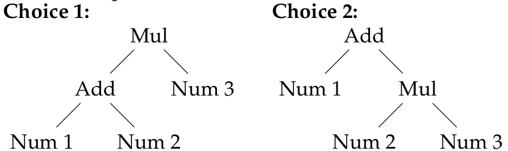

In this section, we will explore how we might use twenty questions to
synthesize an unambiguous parser for a simple arithmetic
calculator. Our approach is to use input/output examples to define a
one-to-one pretty printer. We can then synthesize an unambiguous
parser by inverting the parser.

We demonstrate the idea in Haskell, though the ideas are applicable to
other languages. We begin by defining an Abstract Syntax Tree, which
is the desired output of our parser. Then we learn a pretty printer
for the AST by playing twenty questions. There are two phases: first,
we collect small examples for each case in our syntax tree, starting
from the leaves. Next, we search for ambiguities and ask for examples
to resolve them.

Our language of expressions consists of integers, parenthesized
expressions, and binary addition, subtraction, multiplication, and
division operations. The explicit case for parentheses may at first
seem redundant. We'll see later that they are useful
simplification. Our abstract syntax data type is defined as:

```haskell
data AST =
    Num Int
  | Paren AST
  | Add AST AST
  | Sub AST AST
  | Mul AST AST
  | Div AST AST
```

Bootstrapping by Example
-------------------

We begin by "bootstrapping" our printer and parser by collecting a
small example for printing each case in our AST type. The first case
`Num` is special: it is a leaf node containing a single Int
component. We can use a heuristic in this case, and assume the user
may want to use a standard parser for integers.

<span style="color:red">Q:</span> Is `print (Num 123) == "123"`? (Y/n)

<span style="color:blue">A:</span> Y

Here, twenty questions asks a simple question to check if the printer
should print Num nodes as integers. A few more examples may be
required to completely specify the printer. If we assume that the user
is familiar with regular expressions, we could simply ask:

<span style="color:red">Q:</span> Does `print s` match `/-?[1-9][0-9]*/`? (Y/n/?)

<span style="color:blue">A:</span> ?

In this case, the user answers '?' to indicate they don't understand
the regular expression. In this case, twenty questions can revert back
to the simpler example-based questions.

Once we have a specification for printing Num nodes, we can collect
examples for parsing each internal node.

<span style="color:red">Q:</span> `print (Add (Num 0) (Num 1)) == ?`

<span style="color:blue">A:</span> `"0+1"`

Since we already have learned that `print (Num 0) == "0"` and `print
(Num 1) == "1"`, we can automatically generalize the example to the
constraint:

``` haskell
print (Add e1 e2) == print e1 ++ "+" ++ print e2
```

After repeating this process for Sub, Mul, and Div nodes, we will add
the following constraints to our specification:

```haskell
print (Paren e)   == "(" ++ print e ++ ")"
print (Add e1 e2) == print e1 ++ "+" ++ print e2
print (Sub e1 e2) == print e1 ++ "-" ++ print e2
print (Mul e1 e2) == print e1 ++ "*" ++ print e2
print (Div e1 e2) == print e1 ++ "/" ++ print e2
```

Detecting and Resolving Ambiguities
-----------------------

These constraints are sufficient to produce a pretty printer for our
language. However, they do not specify an unambiguous parser. We want
our parser to be the inverse of a printer. That is, we have the
constraint:

```haskell
parse (print e) == e
```

By requiring `parse` to be the left-inverse of `print`, we can easily check whether our 
constraints specify an unambiguous parser: if `print` is left-invertible, then we 
can synthesize an unambiguous `parse` function. Unfortunately, our specification
of `print` is not left-invertible, because it is not one-to-one. For
example, `print (Mul (Add (Num 1) (Num 2)) (Num 3))` and `print (Add
(Num 1) (Mul (Num 2) (Num 3)))` both produce the string `"1+2*3"`. Our parser
can only return one AST for this string, so our constraint `parse (print e) == e` must
fail for at least one of these ASTs.  Therefore there is no way to define `parse`
to be an inverse of `print` as specified by our current constraints. 
We can automatically detect these kinds of
ambiguities by searching for two ASTs that are printed to the same
value, and resolve each ambiguity by asking the user to choose
which of the two ASTs should be returned by the parser for that input:

<span style="color:red">Q:</span> What is `parse "1+2*3"`? [1/2]



<span style="color:blue">A:</span> 2

Here the user chooses the second option, since `*` should have higher
precedence than `+`. Now that we have desired output of parse, we
need to modify print so that only one AST is printed as `"1+2*3"`.
We do this by removing`(Mul (Add (Num 1) (Num 2)) (Num 3))` from the domain of
print, by adding a precondition that the input AST satisfy a validity check:

```haskell
valid (Mul (Add _ _) _) = False
```

Here, we have generalized the example `(Mul (Add (Num 1) (Num 2)) (Num
3))` to reject any AST where `Add` is an immediate left child of
`Mul`.  This is invalid, since `Mul` should have higher
precedence. With a few more examples, we can establish all the
associativity and precedence rules for our language. The complete
definition of `valid` is then:

```haskell
-- establish associativity
valid (Add _ (Add _ _)) = False
valid (Sub _ (Sub _ _)) = False
valid (Mul _ (Mul _ _)) = False
valid (Div _ (Div _ _)) = False

-- establish precedence
valid (Add _ (Sub _ _)) = False
valid (Sub _ (Add _ _)) = False

valid (Mul (Add _ _) _) = False
valid (Mul (Sub _ _) _) = False
valid (Mul _ (Add _ _)) = False
valid (Mul _ (Sub _ _)) = False
valid (Mul _ (Div _ _)) = False

valid (Div (Add _ _) _) = False
valid (Div (Sub _ _) _) = False
valid (Div _ (Add _ _)) = False
valid (Div _ (Sub _ _)) = False
valid (Div _ (Mul _ _)) = False

valid _ = True
```

Note that a full validity check would be recursive. We omit the
details for clarity. Note also that we can use `Paren` nodes to
override the precedence and associativity rules imposed by the
`valid`.

Generating the Parser
--------------------

Having restricted the domain to `valid` ASTs, we can automatically verify that
`print` is one-to-one. Now we can finally consider how to build
a parser from our specification. For our prototype we
use a simple search-based approach: for each input, we search for a
valid AST whose printing equals the input. Since our printer is
one-to-one, we are guaranteed to only find one such AST. The code for
our parser is:

```haskell
parses [TInt n] = [N n]
parses [TAst ast] = [ast]
parses s = [p | i <- findOps s
              , l <- parses $ take i s
              , r <- parses $ drop (i+1) s
              , let o = op (s!!i)
              , let p = o l r
              , valid p]
```

The `parses` function takes as input a preprocessed list of tokens and
ASTs, and returns a list of ASTs. The preprocessor has recursively
parsed parenthesized expressions, and guaranteed that parentheses
remain.  The implementation of `parses` uses a divide and conquer
search. The first case maps a singleton list containing an Integer
token to a single list containing an Integer AST node. The second case
returns an embedded AST directly. The third case tries to construct
operator nodes. First, it selects an operator token at position `i`,
and parses the left and right operands. Then we lookup up the AST
constructor `o` corresponding to the operator at position `i`, and
construct a parse `p` from the left and right subtrees. Finally, we
ensure that our ast is valid. The parse trees are constructed to
guarantee that they print to the input string. The fact that `print`
is one-to-one ensures that at most one such AST exists.

This parser was written by hand, but one could imagine automatically
synthesizing something similar from the specification. Though we
haven't benchmarked the parser or compared it with other approaches,
it does perform reasonably well even for large expressions. On a
randomly generated input string 4755 characters long, parsing is still 
almost instantenous. One important feature of most parsers is to localize
and report syntax errors. We haven't made any attempt to do this
yet. If a parse fails, the parser will give no indication of the
reason.

This example demonstrates that twenty questions is not necessarily
limited to discovery, but could be useful for more general forms of
program synthesis. Our goal for our parser synthesis tool was to
abstract away the tricky implementation techniques commonly used to
eliminate left-recursion, and establish the precedence and
associativity rules of the language. Instead, we use an interactive
question and answer protocol, in which the system automatically
detects ambiguities in our specification and asks example-based
questions to resolve them. In future work, we could attempt to
automatically synthesize the code we wrote by hand, find more
efficient implementation techniques, and implement error localization
and reporting.


